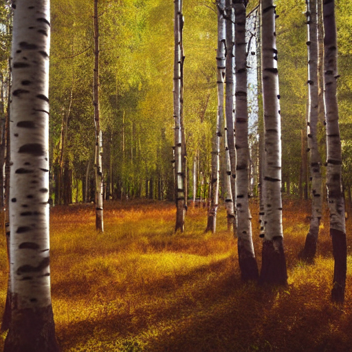
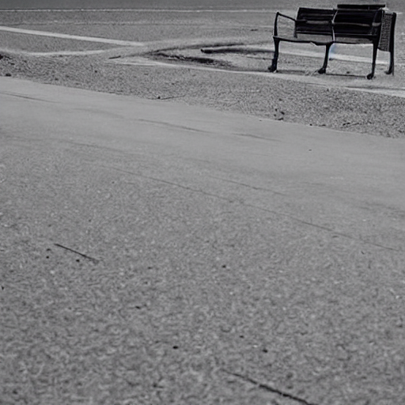
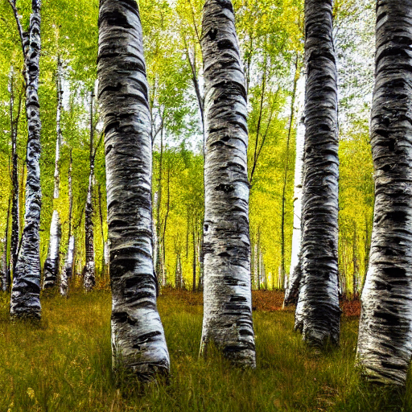

# 🎨 프롬프트 엔지니어링 워크숍 포트폴리오

> Stable Diffusion AI를 활용한 이미지 생성 실습 결과물

## 👤 수강생 정보

| 항목 | 내용 |
|------|------|
| **이름** | 최민규 |
| **학번** | 8015 |
| **작성일** | 2026년 01월 23일 |
| **총 작품 수** | 8개 |

---

## 📚 회차별 학습 기록

### 📖 1회차: 첫 AI 이미지 생성

**학습 기법**: 기본 프롬프팅

#### 작품 1

| 항목 | 내용 |
|------|------|
| **프롬프트** | `a cute orange cat sitting on a sofa` |
| **네거티브** | `-` |
| **생성 시간** | 2026-01-23 05:41:25 |

> 이미지가 무서워요

---

### 📖 2회차: Zero-shot vs Detail

**학습 기법**: 상세 프롬프팅

#### 작품 1

| 항목 | 내용 |
|------|------|
| **프롬프트** | `forest` |
| **네거티브** | `-` |
| **생성 시간** | 2026-01-23 05:48:38 |

> 제로 샷은 매번 다른 다양한 숲이 나와서 본인이 원하는 것이 잘 나오지 않지만 뒤의 이미지는 비교적 일정하게 비슷한 것이 나오는 것 같음.

#### 작품 2

| 항목 | 내용 |
|------|------|
| **프롬프트** | `A forest of tall birch trees, bathed in the daytime sunlight, in pastel tones` |
| **네거티브** | `-` |
| **생성 시간** | 2026-01-23 05:48:38 |

> 제로 샷은 매번 다른 다양한 숲이 나와서 본인이 원하는 것이 잘 나오지 않지만 뒤의 이미지는 비교적 일정하게 비슷한 것이 나오는 것 같음.

---

### 📖 3회차: Persona & Style

**학습 기법**: 스타일 프롬프팅

#### 작품 1

| 항목 | 내용 |
|------|------|
| **프롬프트** | `a forest, A forest with tall birch trees bathed in the daytime sunlight, in pastel tones, in the style of Studio Ghibli anime, soft colors, whimsical, dramatic lighting, strong shadows, cinematic, wide shot, panoramic view` |
| **네거티브** | `-` |
| **생성 시간** | 2026-01-23 05:53:54 |

> 뭔가 아직 그 스타일과 어울리지 않는 결과물도 나오는 것 같다.

---

### 📖 4회차: Negative Prompting

**학습 기법**: 네거티브 프롬프팅

#### 작품 1

| 항목 | 내용 |
|------|------|
| **프롬프트** | `a beautiful portrait of a young woman, elegant dress, garden background, soft lighting` |
| **네거티브** | `bad hands, extra fingers, mutated hands, poorly drawn face, mutation, deformed, ugly` |
| **생성 시간** | 2026-01-23 06:19:47 |

> 창의성이 과한 것 보다 완전히 적은 게 결과물이 더 잘나오는 것 같다.

---

### 📖 5회차: Step-back Prompting

**학습 기법**: 추상화 프롬프팅

#### 작품 1

| 항목 | 내용 |
|------|------|
| **프롬프트** | `alone` |
| **네거티브** | `blurry, low quality, distorted, text, watermark` |
| **생성 시간** | 2026-01-23 06:29:30 |

> 외로움이라는 추상적 개념의 이미지를 적으면서 외로움을 표현하는 게 아니라 그 이미지를 표현한 것 같다.

---

### 📖 6회차: Chain of Thought

**학습 기법**: 레이어 빌딩

#### 작품 1

| 항목 | 내용 |
|------|------|
| **프롬프트** | `a robot, reading a book, on the moon, neon lights, anime style` |
| **네거티브** | `blurry, low quality` |
| **생성 시간** | 2026-01-23 06:35:40 |

> 레이어가 늘어나면서 표현할 것은 많아지는데 자기가 못 그릴 것 같으니까 전에 있는 레이어를 무시한다.

---

### 📖 7회차: 종합 실습

**학습 기법**: 종합

#### 작품 1

| 항목 | 내용 |
|------|------|
| **프롬프트** | `A forest with too low birch trees that let in the daytime sunlight, photorealistic, 8k, highly detailed, professional photography, highly detailed, sharp focus, 8k resolution` |
| **네거티브** | `-` |
| **생성 시간** | 2026-01-23 06:40:19 |

> 하지말라고 했는데도 하는 것을 보면 이 AI은 분명 인공지능이 아닐 것 같음.

---

## 🏆 Best 작품

**선택한 작품**: 

**선택 이유**: 

---

## 💡 워크숍 후기

---

## 🛠️ 사용 기술

- Stable Diffusion
- Streamlit
- Google Colab + ngrok

---

<i>🎓 KNU 프롬프트 엔지니어링 워크숍 수료</i>

